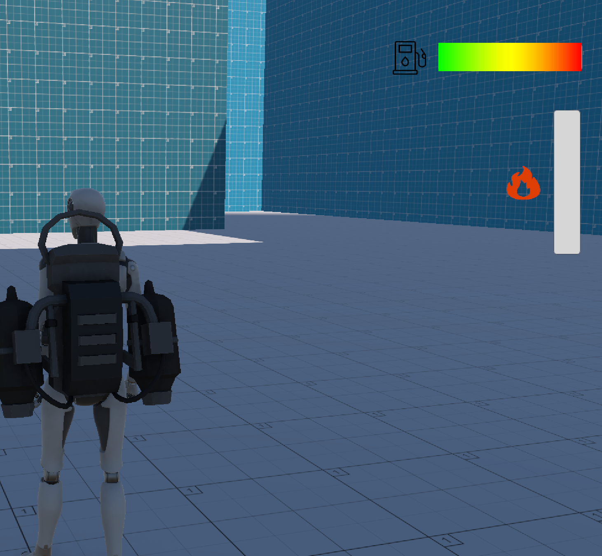
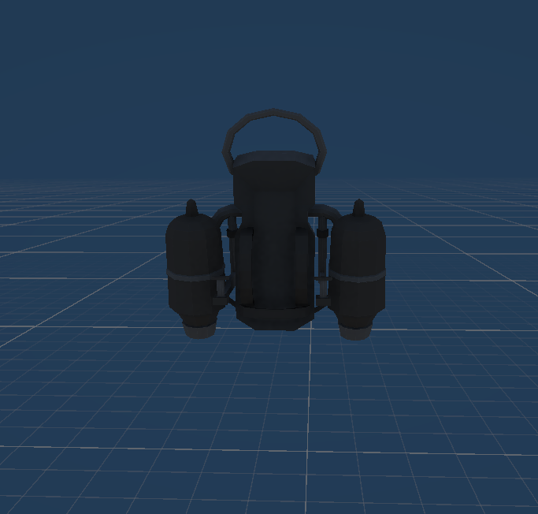
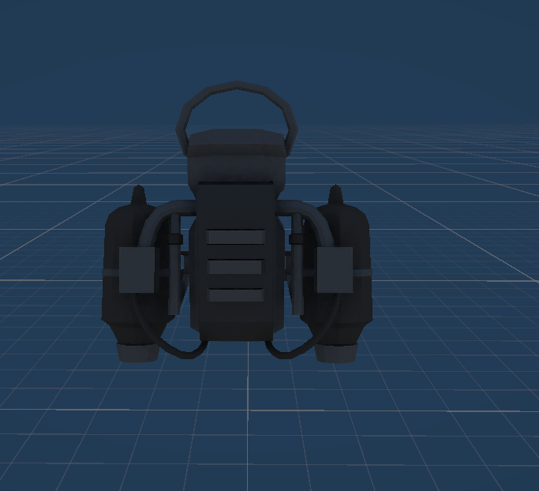
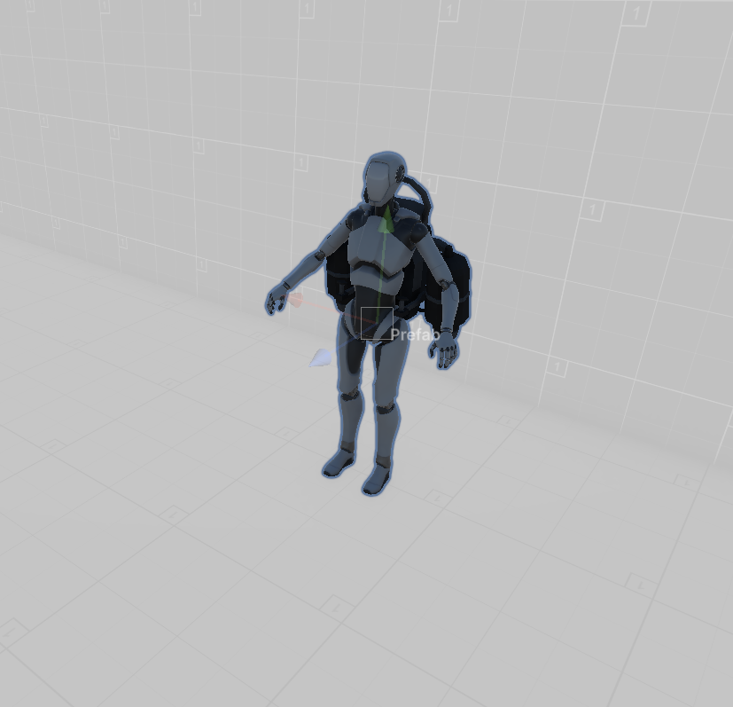
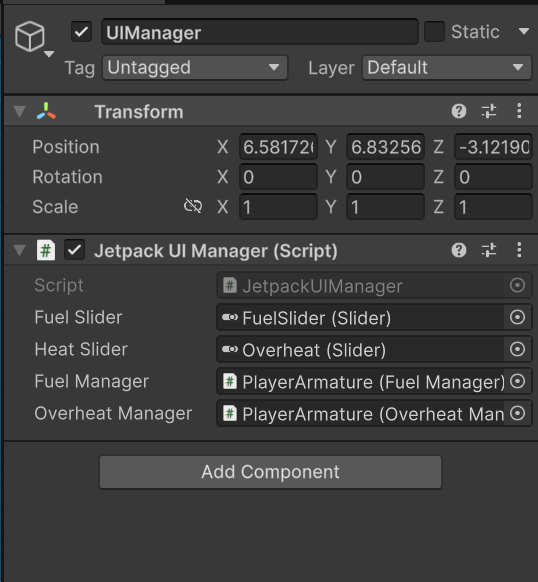
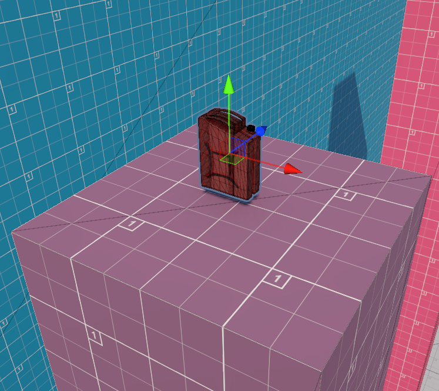

# Jetpack Simulator: Fuel & Overheat Logic

---

## Abstract

---

This thesis documents the design and implementation of a third‑person Jetpack Simulator built in Unity 6 that integrates fuel consumption, ground refueling, overheat gating, jetpack thrust control, and synchronized UI/VFX/SFX, layered on Unity’s Starter Assets third‑person controller for camera and locomotion.
Core mechanics are implemented as rate‑based systems with clamped state updates, exposed via sliders and aligned with player inputs, providing predictable behavior across grounded and airborne states while ensuring idle refueling and consistent movement envelopes.
This document mirrors a formal academic structure modeled after the provided SPH thesis while centering on jet propulsion instead of fluids, and includes formulas, implementation notes, and configuration guidance for reproducibility and tuning.

---

## Contents

---

- Introduction
- Related work and background
- System overview
- Mechanics and models
- Implementation
- UI and feedback
- Testing and results
- Discussion and limitations
- Future work
- References
- Appendix: Code and configuration

---

## Introduction

---

Third‑person traversal games often require a reliable base controller for ground locomotion, camera control, and animation that can be extended with flight‑adjacent mechanics such as jetpacks, which motivates a clear separation between movement, resources, and presentation layers.
This project implements a jetpack with fuel and overheat constraints that interacts with grounded and airborne states, providing thrust, air control, and safety gating through heat thresholds, with feedback via HUD sliders and VFX/SFX.
Design goals include idle ground fuel refilling, directionally consistent speed including diagonals, correct sprint scaling, smooth locomotion transitions, and reliable stationary behavior on small platforms without drift, all driven by readable scripts.

---

## Related work and background

---

Unity’s Starter Assets Third Person Controller provides rotation smoothing, speed change rates, camera targeting, and input abstraction that serve as a robust foundation for extensible traversal mechanics.
Common controller pitfalls include diagonal boosting from non‑normalized input vectors and incorrect sprint application order, both mitigated by normalizing direction before magnitude scaling and by applying sprint multipliers at the target speed stage.
Overheat gating is a classic pacing mechanic that prevents spamming powerful abilities by temporarily disabling them until sufficient cooldown, matching the project’s OverheatManager with a hysteresis threshold for re‑enablement.

---

## System overview

---

The runtime stack composes five main components: FuelManager, OverheatManager, JetpackController, JetpackUIManager, and Starter Assets ThirdPersonController, wired through serialized references and updated per frame.
FuelManager clamps fuel state on consumption and refills, OverheatManager accumulates and cools heat while tracking an overheated flag, and JetpackController coordinates inputs, vertical velocity, resource updates, VFX/SFX toggling, and CharacterController movement
UI sliders are refreshed each frame via JetpackUIManager, and a floating, rotating FuelPickup provides refills via trigger detection with the player hierarchy.

---

## Mechanics and models

---

Fuel consumption occurs while thrusting and refills while grounded, both implemented as rate × time adjustments with clamping to bounds for stability and predictability.
Overheat rises when thrusting and cools when not, setting an overheated flag at the maximum threshold and clearing it below a fraction of max, preventing oscillation at the limit and improving affordances.
Air control scales directional input while airborne, while gravity is applied with a stronger multiplier on descent for snappier fall response, integrated through CharacterController.Move each frame.

---

### Fuel model

---

Let $F_t$ denote fuel at time $t$, with consumption rate $r_c$, ground refill rate $r_r$, thrust gate $u_t\in\{0,1\}$, and grounded gate $g_t\in\{0,1\}$, then

$$
F_{t+\Delta t}=\mathrm{clamp}\!\left(F_t - r_c\,u_t\,\Delta t + r_r\,g_t\,\Delta t,\ 0,\ F_{\max}\right)
$$

This expresses constant‑rate burn during thrust and constant‑rate refill while grounded, guaranteeing bounded invariants and monotonicity under fixed input gates.

---

### Heat model

---

Let $H_t$ be heat at time $t$, with heat increase $r_h$ and cooldown $r_k$, then

$$
H_{t+\Delta t}=\mathrm{clamp}\!\left(H_t + r_h\,u_t\,\Delta t - r_k\,(1-u_t)\,\Delta t,\ 0,\ H_{\max}\right)
$$

An overheated state disables thrust when $H_{t+\Delta t}\ge H_{\max}$, and re‑enables when $H_{t+\Delta t}\le \alpha H_{\max}$ for $0<\alpha<1$, implemented as $0.5$ for clear hysteresis.

---

### Movement and sprint

---

Camera‑relative input is computed and normalized to prevent diagonal speed boost before applying target speed and sprint multipliers for consistent movement envelopes across directions.
Speed changes are smoothed via interpolation and rotation is eased by SmoothDampAngle, while vertical velocity integrates gravity and feeds the CharacterController each frame.

---

## Implementation

---

FuelManager exposes HasFuel, ConsumeFuel, and RefillFuel with clamped arithmetic and a UI callback hook, decoupling state from presentation
OverheatManager exposes IncreaseHeat and CoolDown, sets an overheated flag at max heat, and clears it when cooled below half, providing simple gating semantics
JetpackController gates thrust by fuel and heat, performs refueling on grounded frames irrespective of horizontal motion, applies fall gravity multipliers, toggles effects, and moves the CharacterController using normalized input and configurable air control

---

### FuelManager highlight

---

- Clamps fuel to $[0,F_{\max}]$ on both consumption and refill to avoid negative or overshoot states
- Notifies UI via a centralized UpdateUI method, allowing one place to manage HUD updates
- Exposes a simple HasFuel predicate, simplifying thrust gate checks upstream in JetpackController


---

### OverheatManager highlight

---

- Tracks currentHeat with linear increase and linear cooldown rates for predictable feel and balancing
- Uses overheated as a latched flag, flipping at max and clearing below half, avoiding rapid enable/disable near the boundary
- Provides IsOverheated as a single source of truth for thrust eligibility

---

### JetpackController highlights

---

- Reads axes, combines forward/right vectors, and supports normalization to prevent diagonal speed boost artifacts in both ground and air.
- Refills fuel on every grounded frame regardless of idle or motion, ensuring consistent resource recovery pacing.
- Applies thrust only when Jump is pressed, HasFuel is true, and not overheated, consuming fuel and building heat each frame during thrust.

---

### ThirdPersonController integration

---

- Leverages SpeedChangeRate for acceleration/deceleration and RotationSmoothTime for turn smoothing, avoiding input jitter and snapping.
- Drives animator parameters for locomotion while jump/free‑fall logic is optional if jetpack replaces traditional jumps at the input layer.
- Maintains camera‑relative orientation, making jetpack directionality intuitive with the existing camera rig.

---

## UI and feedback

---

JetpackUIManager updates two sliders each frame by reading normalized fuel and heat ratios, providing immediate feedback on resource state and thresholds such as overheat.
Effects arrays and audio are toggled when thrust begins and ends, aligning sound and particles with state changes to reinforce control feel and responsiveness.

---

## Testing and results

---

Idle refueling is validated by observing fuel increases on grounded frames with no movement input, confirming refills are independent of horizontal displacement.
Directional consistency is validated by inspecting normalized input vectors, verifying no diagonal boost and confirming sprint increases speed appropriately over MoveSpeed.
Stationary stability on small columns is achieved by ensuring zero horizontal input produces zero horizontal displacement on ground branches, preventing drift from nonzero ground vectors.

---

## Discussion and limitations
---

Linear resource models are easy to reason about and tune but do not capture temperature‑dependent cooling or nonlinear burn that could offer deeper dynamics in advanced scenarios.
CharacterController simplifies integration and avoids rigidbody pitfalls but demands careful gravity and movement tuning to prevent jitter on uneven terrain or steps, especially during transitions between ground and air.

---

## Future work

---

- Burst thrust and venting: temporarily increase thrust with higher fuel and heat rates, coupled to bespoke VFX and temporary UI accents for readability.
- Environmental modifiers: apply cooldown multipliers in wind or shade volumes, or heat penalties near hazards, for richer level‑mechanic coupling.
- Animation graph refinement: omit jump/free‑fall triggers when jetpack primary is active or blend bespoke jetpack states with existing locomotion for nuanced transitions.

---

## References

---
- Provided SPH thesis as a structural reference for academic layout and exposition style rather than domain content.
- Scripted sources from this project: FuelManager, OverheatManager, JetpackController, JetpackUIManager, ThirdPersonController, FuelPickup.

---

## Appendix A: Code and Configuration notes


---

### FuelManager Code and Explanation

---

- ConsumeFuel and RefillFuel both clamp state and call UpdateUI to keep HUD in sync with logic changes, preventing UI desync on edge cases such as zero‑crossing.
- HasFuel returns a simple positivity predicate, avoiding off‑by‑epsilon errors by clamping before checks.

---

``` c#
using UnityEngine;

public class FuelManager : MonoBehaviour
{
    public float maxFuel = 100f;
    public float currentFuel = 100f;
    public float fuelConsumptionRate = 10f;
    public JetpackUIManager uiManager;

    public bool HasFuel() => currentFuel > 0f;
    void Start()
    {
        currentFuel = maxFuel;       
    }

    public void ConsumeFuel(float deltaTime)
    {
        currentFuel = Mathf.Max(0f, currentFuel - fuelConsumptionRate * deltaTime);
        UpdateUI();
    }

    public void RefillFuel(float amount)
    {
        currentFuel = Mathf.Min(maxFuel, currentFuel + amount);
        UpdateUI();
    }

    private void UpdateUI()
    {
        if (uiManager != null)
            uiManager.RefreshUI();
    }
}

```
---



---


### OverheatManager Code and Explanation

---

- IncreaseHeat adds heat per second of thrust and latches overheated at maxHeat, while CoolDown reduces heat and clears overheated under half max.
- Using a fixed fraction for re‑enablement is a straightforward hysteresis that avoids flicker while being easy to communicate to players via UI.

---

``` c#
using UnityEngine;

public class OverheatManager : MonoBehaviour
{
    public float maxHeat = 100f;
    public float currentHeat = 0f;
    [SerializeField] private float heatIncreaseRate = 20f;
    [SerializeField] private float coolDownRate = 30f;
    private bool overheated = false;

    public bool IsOverheated() => overheated;

    public void IncreaseHeat(float deltaTime)
    {
        currentHeat += heatIncreaseRate * deltaTime;
        if (currentHeat >= maxHeat)
        {
            currentHeat = maxHeat;
            overheated = true;
        }
    }

    public void CoolDown(float deltaTime)
    {
        if (currentHeat > 0f)
        {
            currentHeat -= coolDownRate * deltaTime;
            if (currentHeat < 0f) currentHeat = 0f;
        }

        // Recover from overheat once you cool below 50%
        if (currentHeat < maxHeat * 0.5f)
            overheated = false;
    }
}

```
---


### JetpackController excerpt and notes

---

- Ground branch performs velocity settle to a small negative value and always refills fuel at groundRefillRate per second, independent of input or idle state.
- Air branch separates thrust frames from cooldown frames, ensuring fuel/heat are only modified during thrust and that cooldown proceeds otherwise, with fall multiplier applied when descending.
- Air control uses a scalar multiplier, and CharacterController.Move composes vertical and horizontal vectors once per frame to avoid double application.

---

``` c#
using StarterAssets;
using UnityEngine;
#if ENABLE_INPUT_SYSTEM
using UnityEngine.InputSystem;
#endif
public class JetpackController : MonoBehaviour
{
    [Header("References")]
    [SerializeField] private CharacterController characterController;
    [SerializeField] private FuelManager fuelManager;
    [SerializeField] private OverheatManager overheatManager;
    [SerializeField] private Animator animator;

    [Header("Jetpack Settings")]
    [Tooltip("Target upward velocity (units/second) while holding jetpack")]
    [SerializeField] private float jetpackThrust = 2f;
    [Tooltip("How fast the vertical speed moves toward target (units/sec^2). Higher = snappier")]
    [SerializeField] private float jetpackAcceleration = 40f;
    [Tooltip("Base gravity (negative)")]
    [SerializeField] private float gravity = -9.81f;
    [Tooltip("Gravity multiplier when falling downwards")]
    [SerializeField] private float fallGravityMultiplier = 2.5f;
    [Tooltip("Fuel refill per second while grounded (idle OR moving)")]
    [SerializeField] private float groundRefillRate = 25f;
    [Tooltip("Minimum vertical velocity when grounded (keeps CC grounded)")]
    [SerializeField] private float groundedVertical = -2f;

    [Header("Effects")]
    [SerializeField] private ParticleSystem[] jetpackParticles;
    [SerializeField] private AudioSource jetpackSound;

    private float verticalSpeed = 0f;
    private bool wasJetpacking = false;
    private ThirdPersonController tpc;

    private int animIDJetpack;

    private void Awake()
    {
        if (characterController == null) characterController = GetComponent<CharacterController>();
        if (fuelManager == null) fuelManager = GetComponent<FuelManager>();
        if (overheatManager == null) overheatManager = GetComponent<OverheatManager>();
        tpc = GetComponent<ThirdPersonController>();

        if (animator == null) animator = GetComponent<Animator>();
        animIDJetpack = Animator.StringToHash("IsJetpacking");
    }

    private void Update()
    {

        float dt = Time.deltaTime;

        // combined grounded check (use TPC's ground logic if available, otherwise CC.isGrounded)
        bool groundedTPC = (tpc != null) && tpc.Grounded;
        bool groundedCC  = characterController.isGrounded;
        bool grounded    = groundedTPC || groundedCC;

        // keep a small downward velocity when grounded to ensure CC stays on ground
        if (grounded && verticalSpeed < groundedVertical) verticalSpeed = groundedVertical;

        // input + conditions
        bool jetKey = IsJetpackHeld();
        bool hasFuel = fuelManager.HasFuel();
        bool isOverheated = overheatManager.IsOverheated();

        // Overheat and Fuel Chck Logic
        bool canJetpack = jetKey && hasFuel && !isOverheated;

        if (canJetpack)
        {
            float target = jetpackThrust;
            verticalSpeed = Mathf.MoveTowards(verticalSpeed, target, jetpackAcceleration * dt);

            // consume fuel & heat
            fuelManager.ConsumeFuel(dt);
            overheatManager.IncreaseHeat(dt);

            PlayJetpackFXIfNeeded();
            if (animator) animator.SetBool(animIDJetpack, true);
        }
        else
        {
            // Not jetpacking, either grounded (refill) or apply gravity mid-air
            if (grounded)
            {
                if (groundRefillRate > 0f)
                    fuelManager.RefillFuel(groundRefillRate * dt);

                // when grounded verticalSpeed doesn't accumulate upward
                if (verticalSpeed > groundedVertical) verticalSpeed = groundedVertical;

                overheatManager.CoolDown(dt);
                StopJetpackFXIfNeeded();
            }
            else
            {
                // Apply gravity. Make falling fall faster.
                float mult = verticalSpeed < 0f ? fallGravityMultiplier : 1f;
                verticalSpeed += gravity * mult * dt;
                overheatManager.CoolDown(dt);
                StopJetpackFXIfNeeded();
            }
            if (animator) animator.SetBool(animIDJetpack, false);
        }

        // clamp vertical speed
        verticalSpeed = Mathf.Clamp(verticalSpeed, -100f, 100f);

        // Apply vertical velocity: pass to ThirdPersonController if present (so only it moves the controller),
        // otherwise fallback to moving the CharacterController directly.
        if (tpc != null)
        {
            tpc.SetExternalVerticalVelocity(verticalSpeed);
        }
        else
        {
            characterController.Move(Vector3.up * verticalSpeed * dt);
        }

    }

    private bool IsJetpackHeld()
    {
#if ENABLE_INPUT_SYSTEM
        
        if (Keyboard.current != null && Keyboard.current.spaceKey.isPressed) return true;
        if (Gamepad.current != null && Gamepad.current.buttonSouth.isPressed) return true; // A / Cross
#endif
        
        return Input.GetButton("Jump");
    }

    private void PlayJetpackFXIfNeeded()
    {
        if (wasJetpacking) return;
        if (jetpackParticles != null)
        {
            foreach (var ps in jetpackParticles)
                if (ps && !ps.isPlaying) ps.Play();
        }
        if (jetpackSound && !jetpackSound.isPlaying) jetpackSound.Play();
        wasJetpacking = true;
    }

    private void StopJetpackFXIfNeeded()
    {
        if (!wasJetpacking) return;
        if (jetpackParticles != null)
        {
            foreach (var ps in jetpackParticles)
                if (ps && ps.isPlaying) ps.Stop();
        }
        if (jetpackSound && jetpackSound.isPlaying) jetpackSound.Stop();
        wasJetpacking = false;
    }
}

```
---






---

### ThirdPersonController configuration checklist

---

- Confirm SprintSpeed > MoveSpeed and that sprint flag affects target speed after input normalization to avoid slower sprint behavior due to ordering.
- Adjust RotationSmoothTime and SpeedChangeRate to eliminate perceived jitter in turns and starts while preserving responsiveness for gameplay.
- If jetpack replaces jump, disable jump and free‑fall animator triggers to avoid visual conflicts when the spacebar is mapped to thrust.
  
---

``` c#
using UnityEngine;
#if ENABLE_INPUT_SYSTEM
using UnityEngine.InputSystem;
#endif

/* Note: animations are called via the controller for both the character and capsule using animator null checks
 */

namespace StarterAssets
{
    [RequireComponent(typeof(CharacterController))]
#if ENABLE_INPUT_SYSTEM
    [RequireComponent(typeof(PlayerInput))]
#endif
    public class ThirdPersonController : MonoBehaviour
    {
        [Header("Player")]
        [Tooltip("Move speed of the character in m/s")]
        public float MoveSpeed = 2.0f;

        [Tooltip("Sprint speed of the character in m/s")]
        public float SprintSpeed = 5.335f;

        [Tooltip("How fast the character turns to face movement direction")]
        [Range(0.0f, 0.3f)]
        public float RotationSmoothTime = 0.12f;

        [Tooltip("Acceleration and deceleration")]
        public float SpeedChangeRate = 10.0f;

        public AudioClip LandingAudioClip;
        public AudioClip[] FootstepAudioClips;

        [Range(0, 1)]
        public float FootstepAudioVolume = 0.5f;

        [Space(10)]
        [Tooltip("The height the player can jump")]
        public float JumpHeight = 1.2f;

        [Tooltip("The character uses its own gravity value. The engine default is -9.81f")]
        public float Gravity = -15.0f;

        [Space(10)]
        [Tooltip(
            "Time required to pass before being able to jump again. Set to 0f to instantly jump again"
        )]
        public float JumpTimeout = 0.50f;

        [Tooltip(
            "Time required to pass before entering the fall state. Useful for walking down stairs"
        )]
        public float FallTimeout = 0.15f;

        [Header("Player Grounded")]
        [Tooltip(
            "If the character is grounded or not. Not part of the CharacterController built in grounded check"
        )]
        public bool Grounded = true;

        [Tooltip("Useful for rough ground")]
        public float GroundedOffset = -0.14f;

        [Tooltip(
            "The radius of the grounded check. Should match the radius of the CharacterController"
        )]
        public float GroundedRadius = 0.28f;

        [Tooltip("What layers the character uses as ground")]
        public LayerMask GroundLayers;

        [Header("Cinemachine")]
        [Tooltip(
            "The follow target set in the Cinemachine Virtual Camera that the camera will follow"
        )]
        public GameObject CinemachineCameraTarget;

        [Tooltip("How far in degrees can you move the camera up")]
        public float TopClamp = 70.0f;

        [Tooltip("How far in degrees can you move the camera down")]
        public float BottomClamp = -30.0f;

        [Tooltip(
            "Additional degress to override the camera. Useful for fine tuning camera position when locked"
        )]
        public float CameraAngleOverride = 0.0f;

        [Tooltip("For locking the camera position on all axis")]
        public bool LockCameraPosition = false;

        // cinemachine
        private float _cinemachineTargetYaw;
        private float _cinemachineTargetPitch;

        // player
        private float _speed;
        private float _animationBlend;
        private float _targetRotation = 0.0f;
        private float _rotationVelocity;
        private float _verticalVelocity;
        private float _terminalVelocity = 53.0f;

        // timeout deltatime
        private float _jumpTimeoutDelta;
        private float _fallTimeoutDelta;

        // animation IDs
        private int _animIDSpeed;
        private int _animIDGrounded;
        private int _animIDJump;
        private int _animIDFreeFall;
        private int _animIDMotionSpeed;

#if ENABLE_INPUT_SYSTEM
        private PlayerInput _playerInput;
#endif
        private Animator _animator;
        private CharacterController _controller;
        private StarterAssetsInputs _input;
        private GameObject _mainCamera;

        private const float _threshold = 0.01f;

        private bool _hasAnimator;
        private bool IsCurrentDeviceMouse
        {
            get
            {
#if ENABLE_INPUT_SYSTEM
                return _playerInput.currentControlScheme == "KeyboardMouse";
#else
                return false;
#endif
            }
        }

        public void SetExternalVerticalVelocity(float value)
        {
            _verticalVelocity = value;
        }

        private void Awake()
        {
            // get a reference to our main camera
            if (_mainCamera == null)
            {
                _mainCamera = GameObject.FindGameObjectWithTag("MainCamera");
            }
        }

        private void Start()
        {
            _cinemachineTargetYaw = CinemachineCameraTarget.transform.rotation.eulerAngles.y;

            _hasAnimator = TryGetComponent(out _animator);
            _controller = GetComponent<CharacterController>();
            _input = GetComponent<StarterAssetsInputs>();
#if ENABLE_INPUT_SYSTEM
            _playerInput = GetComponent<PlayerInput>();
#else
            Debug.LogError(
                "Starter Assets package is missing dependencies. Please use Tools/Starter Assets/Reinstall Dependencies to fix it"
            );
#endif

            AssignAnimationIDs();

            // reset our timeouts on start
            _jumpTimeoutDelta = JumpTimeout;
            _fallTimeoutDelta = FallTimeout;
        }

        private void Update()
        {
            _hasAnimator = TryGetComponent(out _animator);

            // JumpAndGravity();
            GroundedCheck();
            Move();
        }

        private void LateUpdate()
        {
            CameraRotation();
        }

        private void AssignAnimationIDs()
        {
            _animIDSpeed = Animator.StringToHash("Speed");
            _animIDGrounded = Animator.StringToHash("Grounded");
            _animIDJump = Animator.StringToHash("Jump");
            _animIDFreeFall = Animator.StringToHash("FreeFall");
            _animIDMotionSpeed = Animator.StringToHash("MotionSpeed");
        }

        private void GroundedCheck()
        {
            // set sphere position, with offset
            Vector3 spherePosition = new Vector3(
                transform.position.x,
                transform.position.y - GroundedOffset,
                transform.position.z
            );
            Grounded = Physics.CheckSphere(
                spherePosition,
                GroundedRadius,
                GroundLayers,
                QueryTriggerInteraction.Ignore
            );

            // update animator if using character
            if (_hasAnimator)
            {
                _animator.SetBool(_animIDGrounded, Grounded);
            }
        }

        private void CameraRotation()
        {
            // if there is an input and camera position is not fixed
            if (_input.look.sqrMagnitude >= _threshold && !LockCameraPosition)
            {
                //Don't multiply mouse input by Time.deltaTime;
                float deltaTimeMultiplier = IsCurrentDeviceMouse ? 1.0f : Time.deltaTime;

                _cinemachineTargetYaw += _input.look.x * deltaTimeMultiplier;
                _cinemachineTargetPitch += _input.look.y * deltaTimeMultiplier;
            }

            // clamp our rotations so our values are limited 360 degrees
            _cinemachineTargetYaw = ClampAngle(
                _cinemachineTargetYaw,
                float.MinValue,
                float.MaxValue
            );
            _cinemachineTargetPitch = ClampAngle(_cinemachineTargetPitch, BottomClamp, TopClamp);

            // Cinemachine will follow this target
            CinemachineCameraTarget.transform.rotation = Quaternion.Euler(
                _cinemachineTargetPitch + CameraAngleOverride,
                _cinemachineTargetYaw,
                0.0f
            );
        }

        private void Move()
{
    // Calculate target speed based on sprint input
    float targetSpeed = _input.sprint ? SprintSpeed : MoveSpeed;

    if (_input.move == Vector2.zero)
        targetSpeed = 0.0f;

    // Current horizontal speed from controller velocity, ignoring vertical velocity
    float currentHorizontalSpeed = new Vector3(_controller.velocity.x, 0f, _controller.velocity.z).magnitude;

    float speedOffset = 0.1f;
    float inputMagnitude = _input.analogMovement ? _input.move.magnitude : 1f;

    // Smooth acceleration and deceleration to target speed
    if (currentHorizontalSpeed < targetSpeed - speedOffset || currentHorizontalSpeed > targetSpeed + speedOffset)
    {
        _speed = Mathf.Lerp(currentHorizontalSpeed, targetSpeed * inputMagnitude, Time.deltaTime * SpeedChangeRate);
        _speed = Mathf.Round(_speed * 1000f) / 1000f; // Round to 3 decimals
    }
    else
    {
        _speed = targetSpeed;
    }

    _animationBlend = Mathf.Lerp(_animationBlend, targetSpeed, Time.deltaTime * SpeedChangeRate);
    if (_animationBlend < 0.01f)
        _animationBlend = 0f;

    // Normalize input direction to prevent diagonal speed boost
    Vector3 inputDirection = new Vector3(_input.move.x, 0f, _input.move.y).normalized;

    if (_input.move != Vector2.zero)
    {
        _targetRotation = Mathf.Atan2(inputDirection.x, inputDirection.z) * Mathf.Rad2Deg + _mainCamera.transform.eulerAngles.y;
        float rotation = Mathf.SmoothDampAngle(transform.eulerAngles.y, _targetRotation, ref _rotationVelocity, RotationSmoothTime);

        // Rotate towards movement direction smoothly
        transform.rotation = Quaternion.Euler(0f, rotation, 0f);
    }

    Vector3 targetDirection = Quaternion.Euler(0f, _targetRotation, 0f) * Vector3.forward;

    // Move the player controller
    _controller.Move(targetDirection.normalized * (_speed * Time.deltaTime) + new Vector3(0f, _verticalVelocity, 0f) * Time.deltaTime);

    // Update animator speeds; animations won't jump due to commented jump code in original controller
    if (_hasAnimator)
    {
        _animator.SetFloat(_animIDSpeed, _animationBlend);
        _animator.SetFloat(_animIDMotionSpeed, inputMagnitude);
    }
}


        // private void JumpAndGravity()
        // {
        //     if (Grounded)
        //     {
        //         // reset the fall timeout timer
        //         _fallTimeoutDelta = FallTimeout;

        //         // update animator if using character
        //         if (_hasAnimator)
        //         {
        //             _animator.SetBool(_animIDJump, false);
        //             _animator.SetBool(_animIDFreeFall, false);
        //         }

        //         // stop our velocity dropping infinitely when grounded
        //         if (_verticalVelocity < 0.0f)
        //         {
        //             _verticalVelocity = -2f;
        //         }

        //         // Jump
        //         if (_input.jump && _jumpTimeoutDelta <= 0.0f)
        //         {
        //             // the square root of H * -2 * G = how much velocity needed to reach desired height
        //             _verticalVelocity = Mathf.Sqrt(JumpHeight * -2f * Gravity);

        //             // update animator if using character
        //             if (_hasAnimator)
        //             {
        //                 _animator.SetBool(_animIDJump, true);
        //             }
        //         }

        //         // jump timeout
        //         if (_jumpTimeoutDelta >= 0.0f)
        //         {
        //             _jumpTimeoutDelta -= Time.deltaTime;
        //         }
        //     }
        //     else
        //     {
        //         // reset the jump timeout timer
        //         _jumpTimeoutDelta = JumpTimeout;

        //         // fall timeout
        //         if (_fallTimeoutDelta >= 0.0f)
        //         {
        //             _fallTimeoutDelta -= Time.deltaTime;
        //         }
        //         else
        //         {
        //             // update animator if using character
        //             if (_hasAnimator)
        //             {
        //                 _animator.SetBool(_animIDFreeFall, true);
        //             }
        //         }

        //         // if we are not grounded, do not jump
        //         _input.jump = false;
        //     }

        //     // apply gravity over time if under terminal (multiply by delta time twice to linearly speed up over time)
        //     if (_verticalVelocity < _terminalVelocity)
        //     {
        //         _verticalVelocity += Gravity * Time.deltaTime;
        //     }
        // }

        private static float ClampAngle(float lfAngle, float lfMin, float lfMax)
        {
            if (lfAngle < -360f)
                lfAngle += 360f;
            if (lfAngle > 360f)
                lfAngle -= 360f;
            return Mathf.Clamp(lfAngle, lfMin, lfMax);
        }

        private void OnDrawGizmosSelected()
        {
            Color transparentGreen = new Color(0.0f, 1.0f, 0.0f, 0.35f);
            Color transparentRed = new Color(1.0f, 0.0f, 0.0f, 0.35f);

            if (Grounded)
                Gizmos.color = transparentGreen;
            else
                Gizmos.color = transparentRed;

            // when selected, draw a gizmo in the position of, and matching radius of, the grounded collider
            Gizmos.DrawSphere(
                new Vector3(
                    transform.position.x,
                    transform.position.y - GroundedOffset,
                    transform.position.z
                ),
                GroundedRadius
            );
        }

        private void OnFootstep(AnimationEvent animationEvent)
        {
            if (animationEvent.animatorClipInfo.weight > 0.5f)
            {
                if (FootstepAudioClips.Length > 0)
                {
                    var index = Random.Range(0, FootstepAudioClips.Length);
                    AudioSource.PlayClipAtPoint(
                        FootstepAudioClips[index],
                        transform.TransformPoint(_controller.center),
                        FootstepAudioVolume
                    );
                }
            }
        }

        private void OnLand(AnimationEvent animationEvent)
        {
            if (animationEvent.animatorClipInfo.weight > 0.5f)
            {
                AudioSource.PlayClipAtPoint(
                    LandingAudioClip,
                    transform.TransformPoint(_controller.center),
                    FootstepAudioVolume
                );
            }
        }
    }
}

```
---



---

### JetpackUIManager bindings

---

- Assign fuelSlider and heatSlider in the inspector and verify FuelManager and OverheatManager references are connected to avoid null checks gating updates.
- Because RefreshUI uses normalized fractions, ensure maxFuel and maxHeat are set to intended tuning values prior to runtime tests.

---

``` c#
using UnityEngine;
using UnityEngine.UI;

public class JetpackUIManager : MonoBehaviour
{
    public Slider fuelSlider;
    public Slider heatSlider;
    public FuelManager fuelManager;
    public OverheatManager overheatManager;

    void Update()
    {
        RefreshUI();
    }

    public void RefreshUI()
    {
        if (fuelSlider != null && fuelManager != null)
            fuelSlider.value = fuelManager.currentFuel / fuelManager.maxFuel;

        if (heatSlider != null && overheatManager != null)
            heatSlider.value = overheatManager.currentHeat / overheatManager.maxHeat;
    }
}

```
---

---

### FuelPickup Behavior and Tuning

---

- FuelPickup rotates and bounces for spatial readability, and on trigger, finds FuelManager in the player hierarchy to apply fuelAmount and destroy itself.
- Adjust rotationSpeed, bounceHeight, bounceSpeed, and fuelAmount to balance level readability and pacing for exploration or challenge.

---

``` c#
using UnityEngine;

public class FuelPickup : MonoBehaviour
{
    [SerializeField] private float fuelAmount = 30f;
     private float rotationSpeed = 100f;     
     private float bounceHeight = 0.07f;    
     private float bounceSpeed = 1f;        

    private Vector3 startPos;

    private void Start()
    {
        startPos = transform.position;
    }

    private void Update()
    {
        // Rotate around Z axis
        transform.Rotate(0f, 0f, rotationSpeed * Time.deltaTime);

        // Bounce using sine wave
        float newY = Mathf.Sin(Time.time * bounceSpeed * Mathf.PI * 2f) * bounceHeight;
        transform.position = startPos + new Vector3(0f, newY, 0f);
    }

    private void OnTriggerEnter(Collider other)
    {
        if (other.CompareTag("Player"))
        {
            FuelManager fuel = other.GetComponentInParent<FuelManager>();
            if (fuel != null)
            {
                fuel.RefillFuel(fuelAmount);
                Destroy(gameObject);
            }
            else
            {
                Debug.LogWarning("FuelManager not found!");
            }
        }
    }
}

```
---



---

## Appendix B: Tuning formulas and guidance

- Fuel burn: $F(t)=\max(0,\,F_0-r_c t)$ under continuous thrust, simplifying planning for sustained flight segments and checkpoint refuels.
- Heat hysteresis: thrust disable at $H=H_{\max}$ and re‑enable at $H\le 0.5\,H_{\max}$, preventing on‑off thrash and providing clear UI affordances for recovery.
- Fall feel: use $\dot v_y = g$ when rising and $\dot v_y = g\cdot m_f$ with $m_f>1$ when falling to sharpen descent and reduce floatiness without destabilizing landings.


<span style="display:none">[^1][^2][^3][^4][^5][^6][^7][^8][^9]</span>

<div style="text-align: center">⁂</div>

